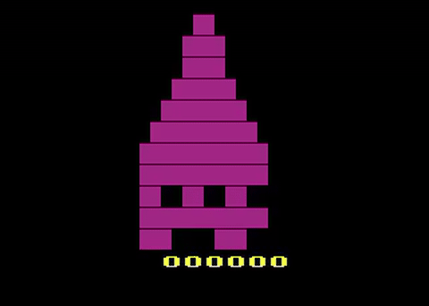

# DREADHOLLOW MANOR

A haunted-house adventure for the Atari 2600.

You are an explorer trapped in Dreadhollow Manor. Six rooms. Three relics per level. One very angry wraith.

## Play it now

Grab `dreadhollow.bin` and load it in your favorite Atari 2600 emulator (Stella, Javatari, etc.), or flash it to a cartridge.

**Javatari (play in browser):** Load the ROM file to play instantly.

## The story

The manor has been empty for decades — except it hasn't. Something pale drifts through the halls, and it does not like visitors. The relics scattered through the rooms are the only things keeping it at bay. Collect them all to weaken its hold... but each time you do, it comes back faster, and the walls themselves seem to change.

## How to play

- **Joystick**: Move through the manor
- **Fire button**: Launch a lantern bolt to temporarily banish the wraith
- **Goal**: Collect all 3 relics on each level to advance
- **Watch out**: Touching the wraith costs a life. You have 3.

### The rooms

- **Library** — Dusty bookshelves, east exit
- **Foyer** — The central hub. West, east, and south exits
- **Chapel** — Rows of pews, west exit
- **Cellar** — Wine barrels, north and east exits
- **Crypt** — Stone tombs, west and east exits
- **Attic** — Old crates, west exit

Relics appear in the Library, Chapel, and Crypt. Each level changes the wall color and makes the wraith faster.

## Tips

- The lantern bolt only banishes the wraith briefly — keep moving!
- Learn the room layout. The Foyer connects to everywhere.
- Higher levels mean a faster wraith. Don't get cornered.

## Tech

- Written in [batari Basic](https://www.randomterrain.com/atari-2600-memories-batari-basic-commands.html)
- 8K ROM, standard kernel
- Source: `dreadhollow.bas` — build with `build.sh` (requires dasm)

---

*Built with patience, playtested with love.*
